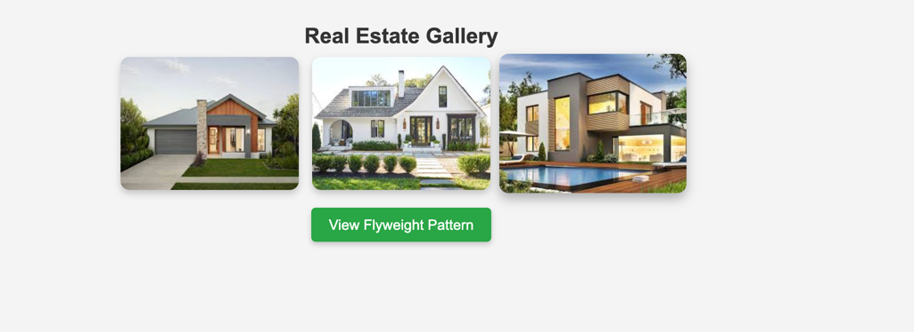
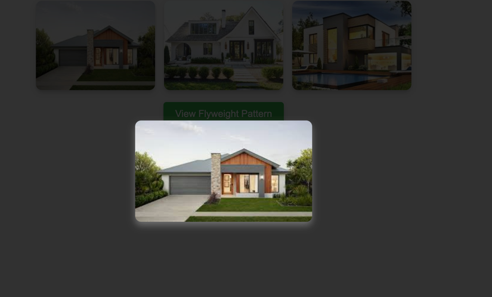
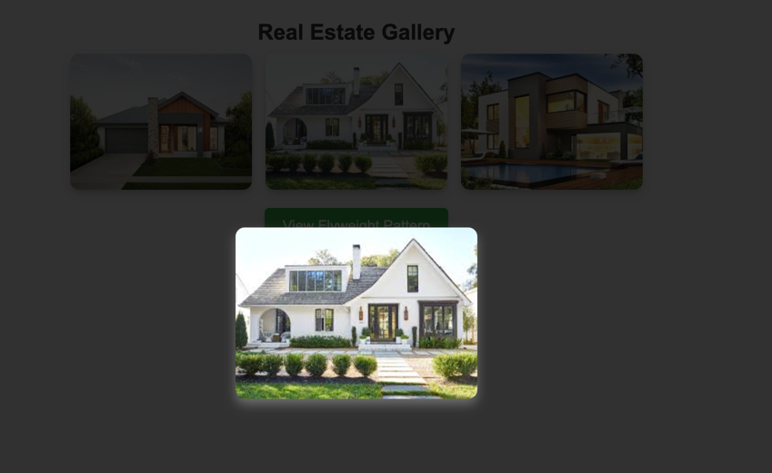
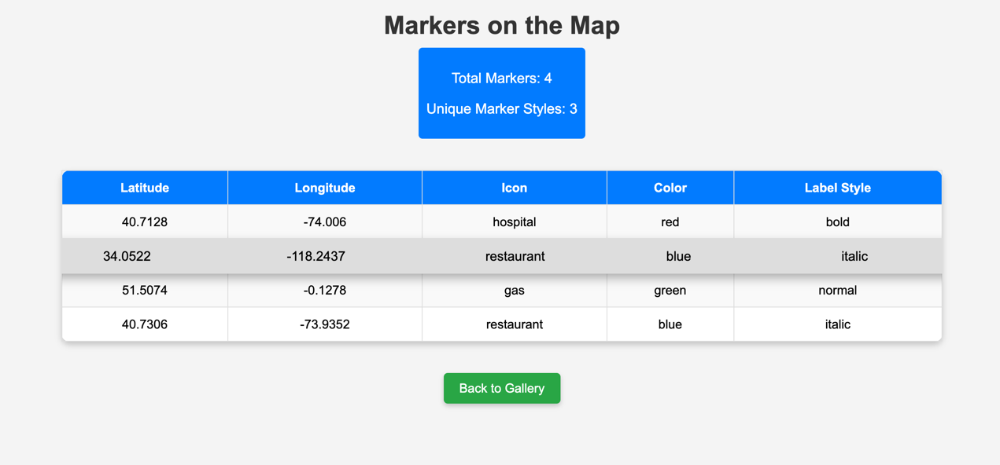

# Spring Boot Flyweight Pattern & Proxy Pattern

This is a Spring Boot application demonstrating the **Flyweight Design Pattern** and **Proxy Design Pattern**. The application allows the display of real estate images in a gallery format, along with the usage of the Flyweight pattern for rendering map markers.

## Features

- **Flyweight Pattern**: Optimizes memory usage by sharing common objects like marker styles (icons, colors, and labels) across multiple map markers.
- **Proxy Design Pattern**: Displays real estate images with hover effects, full-size image previews, and a responsive layout.
- **Memory Efficiency**: The Flyweight pattern reduces memory consumption by reusing shared objects for marker styles on the map.
- **Responsive Design**: The gallery and map are designed to be mobile-friendly, ensuring a great experience on all devices.

## Screenshots of the examples

